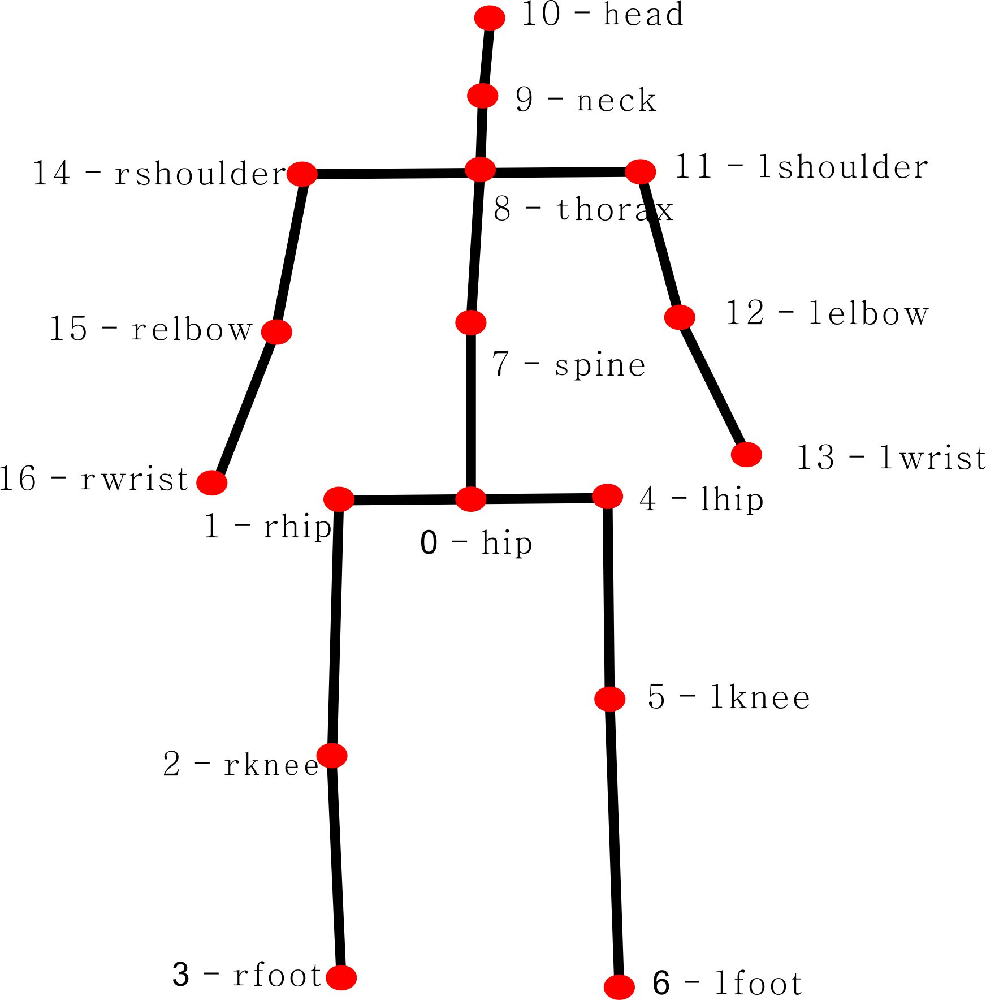
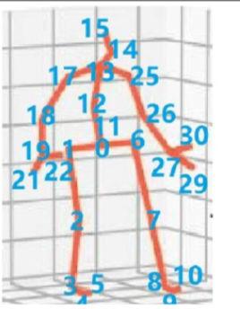

# 数据集生成

## Human3.6M

### 方法
解压Poses_D3_Positions_S*.tgz到特定路径下，然后在prepare_data_h36m.py中设置'--from-source-cdf'为该路径，运行prepare_data_h36m.py即可。
运行结果为生成3D点的npz文件data_3d_36m.npz和2D点的npz文件data_2d_h36m_gt.npz
对于已经生成好3d点坐标的数据集可以直接命名为data_3d_36m.npz并运行prepare_data_h36m.py可以同样生成相应的2D点

## HumanEva-I

### 方法
运行matlab脚本，会生成`converted_32j`，接着运行python prepare_data_humaneva.py -p /path/to/dataset/Release_Code_v1_1_beta/converted_32j --convert-3d。
会生成3D点坐标的npz文件`data_3d_humaneva32.npz`和2D点坐标的npz文件`data_2d_humaneva32_gt.npz`，和human3.6m数据融合即可。

## 3DPW

### 方法
pose2d即为COCO格式的2D坐标点，jointPositions即为3D坐标点，cam_poses为相机外参矩阵，cam_intrinsics为相机内参矩阵。通过简单的矩阵转换即可将3DPW数据的坐标点转换为human3.6m的坐标点，处理同human3.6m数据即可

# 指标

## 17个点

## mediapipe33个点

## 指标计算方法
- 17点中点0即为mediapipe拓扑中点24和点23的中点进行计算
- 17点中点1和点4即为mediapipe拓扑中点24和点23进行计算
- 17点中点2和点5即为mediapipe拓扑中点26和点25进行计算
- 17点中点3和点6即为mediapipe拓扑中点28和点27进行计算
- 17点中点8即为mediapipe拓扑中点12和点11的中点进行计算
- 17点中点14和点11即为mediapipe拓扑中点12和点11进行计算
- 17点中点7即按照mediapipe拓扑中计算出的17点中点8和点0的中点进行计算
- 17点中点15和点12即为mediapipe拓扑中点14和点13进行计算
- 17点中点16和点13即为mediapipe拓扑中点16和点15进行计算
- 17点中点9即为mediapipe拓扑中点9和点10的中点进行计算
- 17点中点10即为mediapipe拓扑中点0点1和点4的重心点进行计算

# 新拓扑

## 新拓扑32个点
由于网络没有训练完，因而更新较粗糙图片，后续可以提供精细示意图

## 与mediapipe33个点拓扑异同
- 32点中点0即为mediapipe拓扑中点24和点23的中点
- 32点中点1和点6即为mediapipe拓扑中点24和点23
- 32点中点2和点7即为mediapipe拓扑中点26和点25
- 32点中点3和点8即为mediapipe拓扑中点28和点27
- 32点中点4点5和点9点10即为mediapipe拓扑中点32点30和点29点31
- 32点中点11为点0的纵向位置，即同为胯部方便确定人体腰部转身朝向的点
- 32点中点13即为mediapipe拓扑中点12和点11的中点
- 32点中点12即按照mediapipe拓扑中计算出的32点中点13和点0的中点进行计算
- 32点中点17和点25即为mediapipe拓扑中点12和点11
- 32点中点14即为mediapipe拓扑中点9和点10的中点
- 32点中点15即为mediapipe拓扑中点0点1和点4的重心点
- 32点中点16为点13的纵向位置，即同为颈部方便确定人体头部转头朝向的点
- 32点中点18和点26即为mediapipe拓扑中点14和点13
- 32点中点19和点27即为mediapipe拓扑中点16和点15
- 32点中点20和点28为点19和点27的纵向位置，即同为腕部方便确定人体手部翻转朝向的点
- 32点中点21点22和点29点30即为mediapipe拓扑中点18点20和点17点19

## 新拓扑想法
由于面部有单独的网络可以确定面部朝向以及生成face mesh，因而不需要通过姿态识别识别内部，且mediapipe拓扑中无腰部等中轴线的拓扑点，所以无法建模弯腰等行为动作，因而在这一方面强于mediapipe